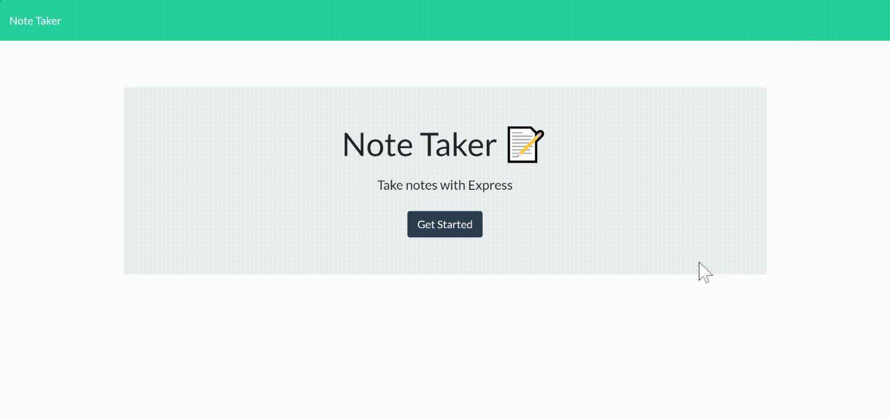

# 11 Express.js
# Note Taker

This application is a simple note taker/saver. Users can enter notes, save them for future viewing, and then delete them if desired.

The application is deployed through Heroku and can be found [here](https://secure-bastion-53851.herokuapp.com). The application's GitHub repository can be found [here](https://github.com/elisesamanthadaly/11-Express.js-Homework).

## Usage

On the application's [homepage](https://secure-bastion-53851.herokuapp.com), click the "Get Started" button to go to the note-taking portion of the application. To return to the homepage, click the "Note Taker" link in the upper left corner.

Click into the "Note Title" and "Note Text" fields to write notes. Once note text has been entered, a save icon will appear in the upper right corner, which can be clicked to save the current note.

Saved notes are listed in the left column. Click on the title text of a saved note to display it in the right column. Click the trashcan icon on a saved note to delete it.

When done viewing a note, click the pencil icon in the upper right corner to enter a new note.

## Credits

Starter code for the application's front-end provided by UNC Coding Bootcamp.

This application relies on [Express.js](https://www.npmjs.com/package/express).

## License

MIT License

Copyright (c) 2021 Elise Daly

Permission is hereby granted, free of charge, to any person obtaining a copy
of this software and associated documentation files (the "Software"), to deal
in the Software without restriction, including without limitation the rights
to use, copy, modify, merge, publish, distribute, sublicense, and/or sell
copies of the Software, and to permit persons to whom the Software is
furnished to do so, subject to the following conditions:

The above copyright notice and this permission notice shall be included in all
copies or substantial portions of the Software.

THE SOFTWARE IS PROVIDED "AS IS", WITHOUT WARRANTY OF ANY KIND, EXPRESS OR
IMPLIED, INCLUDING BUT NOT LIMITED TO THE WARRANTIES OF MERCHANTABILITY,
FITNESS FOR A PARTICULAR PURPOSE AND NONINFRINGEMENT. IN NO EVENT SHALL THE
AUTHORS OR COPYRIGHT HOLDERS BE LIABLE FOR ANY CLAIM, DAMAGES OR OTHER
LIABILITY, WHETHER IN AN ACTION OF CONTRACT, TORT OR OTHERWISE, ARISING FROM,
OUT OF OR IN CONNECTION WITH THE SOFTWARE OR THE USE OR OTHER DEALINGS IN THE
SOFTWARE.
